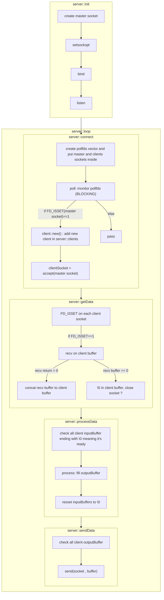
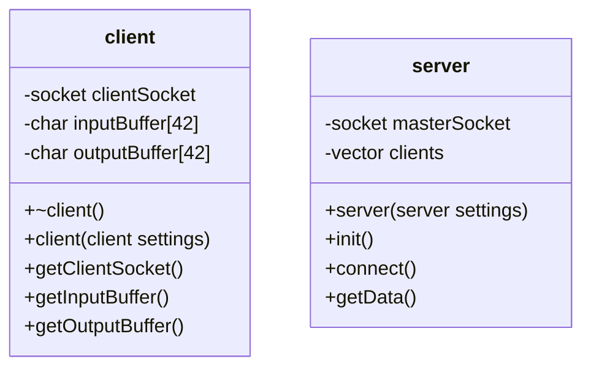

# ft-irc 8-)
An IRC server
## Graph :

```mermaid
flowchart TD
    subgraph server::init
        direction TB
        socket["create master socket"]
        setsockopt
        bind
        listen
        socket-->setsockopt-->bind-->listen
        end
    subgraph server::loop
        direction TB
        subgraph server::connect
            direction TB
            pollfds[create pollfds vector and put master and clients sockets inside]
            poll["poll: monitor pollfds (BLOCKING)"]
            newClient["client::new() : add new client in server::clients"]
            accept["clientSocket = accept(master socket)"]
            newClient-->accept
            pollfds-->poll
            poll-->|"if FD_ISSET(master socket)==1"|newClient
            poll-->|"else"|pass
            end
        subgraph server::getData
            direction TB
            checkClients["FD_ISSET on each client socket"]
            recv["recv on client buffer"]
            concat["concat recv buffer to client buffer"]
            close_socket["\0 in client buffer, close socket ?"]
            checkClients-->|"if FD_ISSET==1"|recv
            recv-->|"recv return > 0"|concat
            recv-->|"recv buffer == 0"|close_socket
            direction TB
            end
        subgraph server::processData
            direction TB
            checkinput["check all client inputBuffer ending with \0 meaning it's ready"]
            process["process: fill outputBuffer"]
            reset["resset inputBuffers to \0"]
            checkinput-->process-->reset
            end
        subgraph server::sendData
            direction TB
            checkoutput["check all client outputBuffer"]
            send["send(socket , buffer)"]
            checkoutput-->send
            end
        end

    server::init-->server::connect-->server::getData-->server::processData-->server::sendData
```
## Classes :

```mermaid
classDiagram
    class client{
        +~client()
        +client(client settings)
        +getClientSocket()
        +getInputBuffer()
        +getOutputBuffer()
        -socket clientSocket
        -char inputBuffer[42]
        -char outputBuffer[42]
    }

    class server{
        +server(server settings)
        -socket masterSocket
        -vector<client> clients
        +init()
        +connect()
        +getData()
    }
```