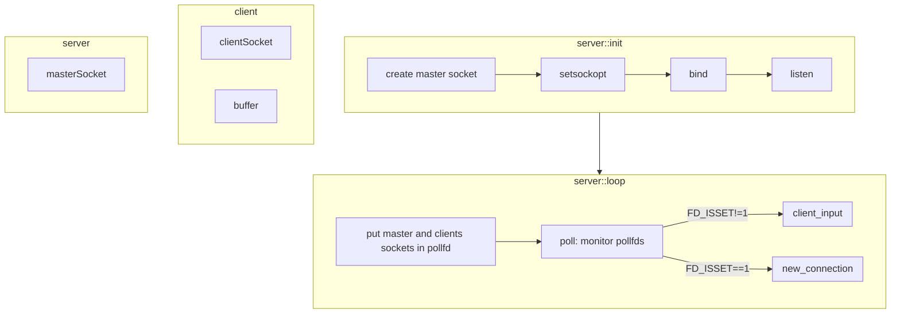

```mermaid
flowchart TD
    subgraph server::init
        socket[create master socket]
        setsockopt
        bind
        listen
        socket-->setsockopt-->bind-->listen
        end

    subgraph server::loop
        pollfds[put master and clients sockets in pollfd]
        poll[poll: monitor pollfds]
        subgraph new_connection

            end
        subgraph client_input

            end
        pollfds-->poll
        poll-->|FD_ISSET==1|new_connection
        poll-->|FD_ISSET!=1|client_input
        end

    server::init --> server::loop

    subgraph client
        clientSocket
        buffer
        end

    subgraph server
        masterSocket
        buffer    
        end
```

    
    
