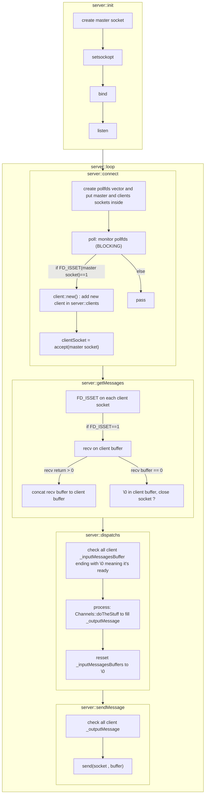
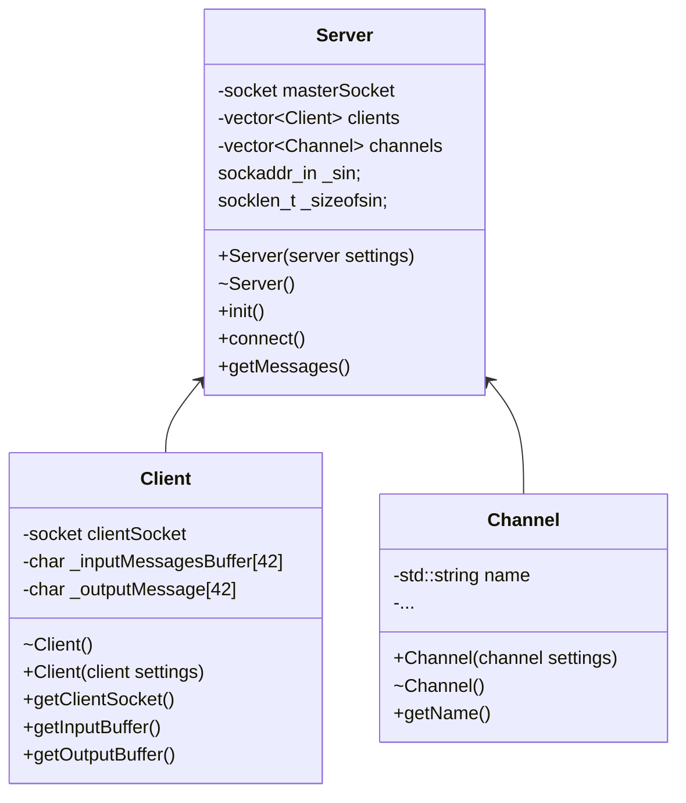

# TODO
- envoyer le bon code pour la loste des users dans JOIN : RPL_NAMREPLY
- rendre le passProvided obligatoire dans toutes les fonctions
- rendre les classes private
- verifier la presence de tous les retours et erreurs dans chaque fonction

# ft-irc
An IRC server
## Graph :

## Classes :

