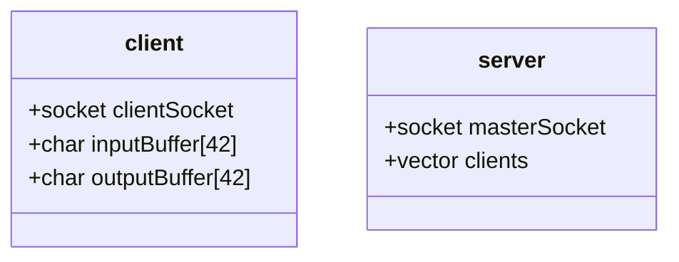

```mermaid
flowchart TD
    subgraph server::init
        direction TB
        socket[create master socket]
        setsockopt
        bind
        listen
        socket-->setsockopt-->bind-->listen
        end
    subgraph server::loop
        direction TB
        subgraph server::connect
            direction TB
            pollfds[put master and clients sockets in pollfds vector]
            poll["poll: monitor pollfds (BLOCKING)"]
            newClient["add new client in server::clients"]
            accept["clientSocket = accept(master socket)"]
            newClient-->accept
            pollfds-->poll
            poll-->|"if FD_ISSET(master socket)==1"|newClient
            poll-->|"else"|pass
            end
        subgraph server::getdata
            direction TB
            checkClients["FD_ISSET on each client socket"]
            recv["recv on client buffer"]
            concat["concat recv buffer to client buffer"]
            close_socket["\0 in client buffer, close socket ?"]
            checkClients-->|"if FD_ISSET==1"|recv
            recv-->|"recv return > 0"|concat
            recv-->|"recv buffer == 0"|close_socket
            direction TB
            end
        subgraph server::processdata
            direction TB
            checkinput["check all client inputBuffer ending\0"]
            process["process: fill outputBuffer"]
            set["set inputBuffers to \0"]
            checkinput-->process-->set
            end
        subgraph server::senddata
            direction TB
            checkoutput["check all client outputBuffer"]
            send["send(socket , buffer)"]
            checkoutput-->send
            end
        end

    server::init-->server::connect-->server::getdata-->server::processdata-->server::senddata


```

```mermaid
classDiagram
    class client{
        +socket clientSocket
        +char inputBuffer[42]
        +char outputBuffer[42]
    }

    class server{
        +socket masterSocket
        +vector<client> clients
    }
```