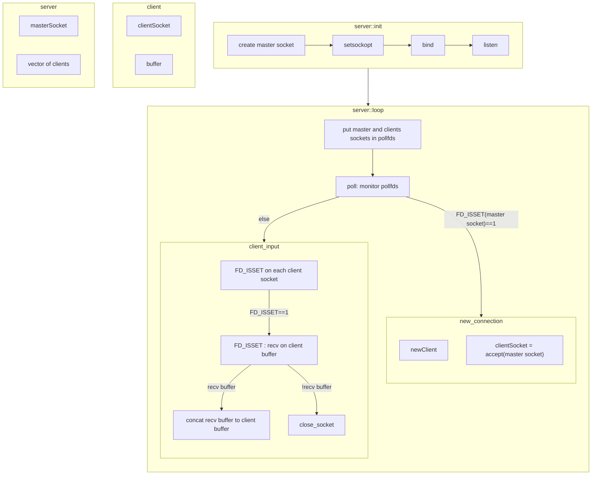

```mermaid
flowchart TD
    subgraph server::init
        socket[create master socket]
        setsockopt
        bind
        listen
        socket-->setsockopt-->bind-->listen
        end

    subgraph server::loop
        direction TB
        pollfds[put master and clients sockets in pollfds]
        poll[poll: monitor pollfds]
        subgraph new_connection
            direction TB
            newClient
            accept["clientSocket = accept(master socket)"]
            end
        subgraph client_input
            direction TB
            checkClients["FD_ISSET on each client socket"]
            recv["FD_ISSET : recv on client buffer"]
            concat["concat recv buffer to client buffer"]
            close_socket
            checkClients-->|"FD_ISSET==1"|recv
            recv-->|"recv buffer"|concat
            recv-->|"!recv buffer"|close_socket
            
            end
        pollfds-->poll
        poll-->|"FD_ISSET(master socket)==1"|new_connection
        poll-->|"else"|client_input
        end

    server::init --> server::loop

    subgraph client
        clientSocket
        buffer
        end

    subgraph server
        masterSocket
        buffer
        clients[vector of clients]
        end
```